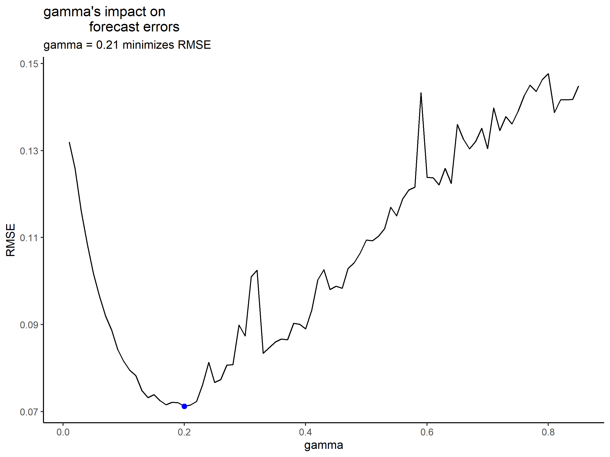

Intro to Time Series
================
Riley M. Anderson
April 24, 2024

  

- [Time Series Analysis](#time-series-analysis)
  - [Why use time-series?](#why-use-time-series)
  - [Autocorrelation & Autocovariance](#autocorrelation--autocovariance)
- [Stationarity vs Nonstationarity](#stationarity-vs-nonstationarity)
  - [Transforming for stationarity](#transforming-for-stationarity)
    - [Differencing](#differencing)
    - [Detrending](#detrending)
- [Basic Model Types: AR(p), MA(q), ARMA(p,q), ARIMA(p,d,q),
  Decomposition](#basic-model-types-arp-maq-armapq-arimapdq-decomposition)
  - [Autoregressive AR(p) Models](#autoregressive-arp-models)
  - [Moving Average MA(q) Models](#moving-average-maq-models)
  - [Autoregressive Moving Average ARMA(p,q)
    Models](#autoregressive-moving-average-armapq-models)
  - [Autoregressive Integrated Moving Average ARIMA(p,d,q)
    Models](#autoregressive-integrated-moving-average-arimapdq-models)
  - [Decomposition Models](#decomposition-models)
- [Fitting AR/MA/ARMA/ARIMA models with the Box Jenkins
  Method](#fitting-armaarmaarima-models-with-the-box-jenkins-method)
  - [Fit some time series with real
    data](#fit-some-time-series-with-real-data)
    - [Check for stationarity](#check-for-stationarity)
  - [Transforming for Stationarity & Identifying Model
    Parameters](#transforming-for-stationarity--identifying-model-parameters)
  - [Checking the Residuals of the Model Fit (Ljung-Box
    test)](#checking-the-residuals-of-the-model-fit-ljung-box-test)
  - [Making a forecast for each
    model](#making-a-forecast-for-each-model)
- [Fitting Seasonal Trend Loess (STL) Decomposition
  Models](#fitting-seasonal-trend-loess-stl-decomposition-models)
- [Exponential Smoothing](#exponential-smoothing)
- [Simple Exponential Smoothing](#simple-exponential-smoothing)
  - [Validation of SES](#validation-of-ses)
- [Holt’s method](#holts-method)
- [Holt-Winter’s Seasonal method](#holt-winters-seasonal-method)
  - [Optimize the Holt-Winter’s additive
    model](#optimize-the-holt-winters-additive-model)
- [Damping model](#damping-model)
- [Where to go Next](#where-to-go-next)
- [Session Information](#session-information)

# Time Series Analysis

(Univariate) time series data is defined as sequence data over time:
,
,…,


where *T* is the time period and
 is the
value of the time series at a particular point.

Examples: daily temperatures in Boston, US presidential election turnout
by year, minute stock prices

Variables in time series models generally fall into three categories:

1)  endogenous (past values of the time-series in questions)

2)  random noise (accounting for uncertainty (CIs), and past random
    shocks)

3)  exogenous (predictors outside the time-series)

All time series models involve (1) and (2) but (3) is optional.

## Why use time-series?

1)  many forecasting tasks actually involve small samples which makes
    machine learning less effective

2)  time series models are more interpretable and less black box than
    machine learning algorithms

3)  time series appropriately accounts for forecasting uncertainty.

As an example, lets look at the following data generating process known
as a random walk:


We can compare the forecasting performance of linear regression to that
of a basic time series model known as an AR(1) model.

<!-- -->

Linear regression overfits the past observations and doesn’t account for
compounding error. With successive future predictions, the confidence
interval should increase over time. Too much weight on random error.

AR model just forecasts the average
 values from the past
observations.

## Autocorrelation & Autocovariance

Autocorrelation/autocovariance refers to the correlation/covariance
between two observations in the time series at different points.

The central idea behind it is how related the data/time series is over
time.

For ease of interpretation we typically focus on autocorrelation
i.e. what is the correlation between
 and

for some integer *p*. (Correlation between all *p* periods about in the
sample)

A related concept is partial autocorrelation that computes the
correlation adjusting for previous lags/periods i.e. the autocorrelation
between
 and

adjusting for the correlation of
 and
,
… ,
.

When analyzing time series we usually view autocorrelation/partial
autocorrelation in ACF/PACF plots.

Let’s view this for the random walk model we analyzed above:


``` r
dat <- sim.random.walk(n = 100)

#plot random walk
sim.plot <- dat %>% ggplot(aes(t,X)) +
  geom_line() +
  xlab("T") +
  ylab("X") +
  ggtitle("Time Series Plot")

#ACF plot
sim.corr <- ggAcf(dat$X,type="correlation") +
  ggtitle("Autocorrelation ACF Plot")

#PACF plot
sim.partial <- ggAcf(dat$X,type="partial") +
  ggtitle("Partial Autocorrelation PACF Plot")

grid.arrange(sim.plot, sim.corr, sim.partial)
```

<!-- -->

The ACF plot shows a high degree of correlation between each successive
lag. This makes sense because we simulated this data with a random walk,
where each successive time point value
 is a
function of the previous time point value
.

In contrast, the PACF plot shows the correlation between lags
.
The correlation is high when the lag is 1, but is weak for lags \> 1
(i.e., lags with greater distance in time points).

# Stationarity vs Nonstationarity

Is the distribution of the data over time consistent?

There are two main forms of stationarity.

- Strict stationarity imples:

  - The cumulative distribution function of the data does not depend on
    time:

 = F_{X}(X_{1 + \Delta},...,X_{T + \Delta}) \forall \Delta \in \mathbb{R}")

- Weak stationarity implies:

  - the mean of the time series is constant
     = E(X_{t + \Delta})")

  - the autocovariance/autocorrelation only depends on the time
    difference between points
     = ACF(X_{1}, X_{\Delta})")

  - the time series has a finite variance
     < \infty \forall \Delta \in \mathbb{R}")

``` r

df<-sim.stationary.example(n=1000)

head(df)
##   t          X1        X2          X3
## 1 1 -0.44377902 0.2318932  1.28923628
## 2 2  2.24020140 2.4106363 -1.63588767
## 3 3  1.93954222 3.6174854 -0.08243868
## 4 4  1.68071924 5.9578636 -1.08716585
## 5 5  0.42455859 4.3604708  0.97287262
## 6 6 -0.03806078 6.6450558 -1.87240895

gns <- ggplot(df, aes(x = t, y = X1)) +
  geom_line() +
  labs(x = "T", y = "X1", title = "Nonstationary")

gs <- ggplot(df, aes(x = t, y = X3)) +
  geom_line() +
  labs(x = "T", y = "X3", title = "Stationary")

grid.arrange(gns, gs)
```

<!-- -->

The nonstationary time series has an unstable mean, that changes over
time. Whereas the stationary time series appears to have a constant mean
over time, and finite variance.

``` r

#ACF for nonstationary and stationary time series
nsACF <- ggAcf(df$X1, type = "correlation") +
  labs(x = "T", y = "X1", title = "Nonstationary")

sACF <- ggAcf(df$X3, type = "correlation") +
  labs(x = "T", y = "X3", title = "Stationary")

grid.arrange(nsACF, sACF)
```

<!-- -->

The nonstationary time series has all significant correlations across
lags and shows non mean-reverting behavior.

The stationary time series has non-significant correlations between
almost all lags.

We can perform a unit root test (Augmented Dickey-Fuller test) to test
for stationarity:

``` r

adf.test(df$X1)
## 
##  Augmented Dickey-Fuller Test
## 
## data:  df$X1
## Dickey-Fuller = -1.4568, Lag order = 9, p-value = 0.8083
## alternative hypothesis: stationary
```

In the ADF test, the null hypothesis is *nonstationary*, while the
alternative hypothesis is *stationary*. For the above time series, we
fail to reject to null hypothesis (*P* = 0.808) and conclude that the
time series exhibits nonstationarity.

``` r

adf.test(df$X3)
## 
##  Augmented Dickey-Fuller Test
## 
## data:  df$X3
## Dickey-Fuller = -9.0269, Lag order = 9, p-value = 0.01
## alternative hypothesis: stationary
```

In the stationary example, the ADF test confirms stationarity by
rejecting the null hypothesis (*P* = 0.01).

## Transforming for stationarity

Typically, nonstationary data are transformed by differencing or
detrending to make the data more stationary.

### Differencing

Differencing involves taking differences between successive time series
values.

The order of differencing is defined as *p* for
.

Let’s transform a nonstationary time series to stationary by
differencing with the random walk model.

In a random walk

where
 iid").

Differencing with an order of one means that
.

With data generated by random walk, the differencing order is t-1, which
if we difference by this order, we have removed the

term and are left with the random noise term
,
which is by definition, stationary.

``` r

# differencing with an order of 1
diff <- df$X1 - lag(df$X1, 1) # for all values of X1, subtract the previous (1th) value


#plot original and differenced time series
untrans <- ggAcf(df$X1, type = "correlation")

lag.trans <- ggAcf(diff, type = "correlation")

grid.arrange(untrans, lag.trans)
```

<!-- -->

The ACF for df\$X1 (generated by random walk), does not die off quickly,
suggesting high correlations between each successive term (lag).

However, the lag transformed (1 lag difference between time points) has
weak correlations between these lags, showing stationarity.

### Detrending

An alternative way to induce stationarity from nonstationary data.

Detrending involves removing a deterministic relationship with time.

As an example suppose we have the following data generating process

where
iid").

Here, we have a deterministic linear relationship with time, and
removing that relationship would leave the transformed time series

where the only predictor is the random noise term
,
which is by definition stationary with constant mean and finite
variance.

Detrending involves using the transformed time series
.

In the real world, we don’t know the actual relationship with time, so
we build a model and then remove the time component
()
leaving only the random noise term (residual error
).

``` r

detrended <- resid(lm(X2 ~ t, data = df))

#plot original and detrended time series
untransX2 <- ggAcf(df$X2, type = "correlation")

detrendedX2 <- ggAcf(detrended, type = "correlation")

grid.arrange(untransX2, detrendedX2)
```

<!-- -->

The original data exhibit nonstationary behavior, with correlations
extending far beyond the confidence intervals (highly significant).

Alternatively, the detrended time series correlations fall mainly within
the confidence intervals (not significant) and exhibit stationary
behavior.

# Basic Model Types: AR(p), MA(q), ARMA(p,q), ARIMA(p,d,q), Decomposition

## Autoregressive AR(p) Models

AR models specify
 as a
function of lagged time series values

i.e


where  is a mean
term and
")
is a random error.
 is a a
function of the 
(mean/intercept) term plus a linear combination of past lagged values.
Our model will estimate the

parameters using one of several methods (Yule-Walker equations, Maximum
Likelihood, or even linear regression).

AR models can sometimes be non-stationary if a unit root is present
(rejected the null in an ADF test).

In AR models, because we depend on past lagged

values, random noise terms in past periods can have influence on the
future predictions. Conceptually, this is why the process can be
nonstationary. Past large shocks can cause a series to diverge and
become non mean-reverting and have infinite variance.

When fitting an AR model the key choice is *p*, the number of lags (and
 parameters)
to include in the model.

## Moving Average MA(q) Models

Similar to AR models, but instead of using past lagged values of the
time series, we use past lagged random shock events (random error terms)

MA models specify
 using
random noise lags:


where  is a mean
term and
")
is a random error.
 is a a
function of the 
(mean/intercept) term plus the random noise term in the current period

plus a linear combination of the past random noise terms
.
Our model will estimate the

parameters using one of several methods

Because MA models specify
 as a
function of past random noise terms, we don’t actually observe these
past random noise terms, fitting them is more complicated and involves
interative fitting. Also, because MA models are a linear combination of
past random shocks, they are by construct, stationary (random noise
terms are independent and identically distributed, *iid*, constant mean
and finite variance).

 is a
function of a finite number of random lags, past random shocks can only
have a finite influence on future periods. This is why MA models are
always stationary, whatever influence the random shocks have will trend
toward zero over time.

Similar to an AR model, when fitting an MA model the key choice is *q*,
the number of random shock lags.

## Autoregressive Moving Average ARMA(p,q) Models

ARMA(p,q) models are a combination of an AR and MA model:


where  is a mean
term and
")
is a random error.
 is a
function of a 
(mean/intercept) term plus a random noise term in the current period

plus a linear combination of both past lagged time series values and
also past random noise terms

When fitting an ARMA model, we need to choose two things: p, the number
of AR lags, and q, the number of MA lags.

## Autoregressive Integrated Moving Average ARIMA(p,d,q) Models

ARIMA(p,d,q) is an ARMA model with differencing.

Take an ARMA model and add in differencing. We take the difference
between the time series at successive points in time.

When fitting an ARIMA model we need to choose three things: p, the
number of AR lags, q, the number of MA lags, and d, the number of
differences to use.

## Decomposition Models

Decomposition models specify
 as a
combination of a trend component
(),
seasonal component
(), and
an error component/residual
()
i.e. ").

Common decomposition forms are:

or

(where we then take logs to recover the additive form).

There are various ways to estimate the different trend components:
exponential smoothing, state space models/Kalman filtering, STL models,
etc.

# Fitting AR/MA/ARMA/ARIMA models with the Box Jenkins Method

How to fit AR/MA/ARMA/ARIMA models on a real data set and review a
generic strategy for fitting them (Box Jenkins method).

This process involves several steps to help identify the *p*, *d*, and
*q* parameters that we need:

- Identify whether the time series is stationary or not

- Identify *p*, *d*, and *q* of the time series by

  - Making the time series stationary through differencing/detrending to
    find *d*
  - Looking at ACF/PACF to find *p* and *q*
  - Using model fit diagnostics like AIC or BIC to select the best model
    to find *p*, *d*, and *q*

- Check the model fit using the Ljung-Box test

## Fit some time series with real data

This data comes from the FRED database (St. Louis Federal Reserve) and
describes the monthly unemployment rate for Massachusetts between
January 1976 and January 2020.

            DATE MAURN
    1 1976-01-01  11.6
    2 1976-02-01  11.3
    3 1976-03-01  10.9
    4 1976-04-01   9.9
    5 1976-05-01   9.4
    6 1976-06-01   9.8

Where MAURN is the monthly unemployment rate.

### Check for stationarity

``` r

ur %>% 
  ggplot(aes(x = DATE, y = MAURN)) +
  geom_line()
```

<!-- -->

Doesn’t look stationary, mean varies over time.

``` r

ggAcf(ur$MAURN, type = "correlation")
```

<!-- -->
Again, looks nonstationary.

``` r

adf.test(ur$MAURN)
## 
##  Augmented Dickey-Fuller Test
## 
## data:  ur$MAURN
## Dickey-Fuller = -3.0954, Lag order = 8, p-value = 0.1146
## alternative hypothesis: stationary
```

Fail to reject the null hypothesis of non-stationarity.

## Transforming for Stationarity & Identifying Model Parameters

``` r

ar.mod <- auto.arima(ur$MAURN,
                     max.d = 0, # no differencing
                     max.q = 0, # no random noise terms
                     allowdrift = T #include a mu term
                     # note only p is allowed to vary -> AR model
                     # p is the number of autoregressive lags
                     )

ar.mod
## Series: ur$MAURN 
## ARIMA(1,0,0) with non-zero mean 
## 
## Coefficients:
##          ar1    mean
##       0.9787  5.7425
## s.e.  0.0101  0.8498
## 
## sigma^2 = 0.2:  log likelihood = -325.44
## AIC=656.88   AICc=656.93   BIC=669.7
```

``` r

ma.mod <- auto.arima(ur$MAURN,
                     max.d = 0, # no differencing
                     max.p = 0, # no lags
                     allowdrift = T #include a mu term
                     # note only q is allowed to vary -> MA model
                     # q is the number of random noise (shock lag) events
                     )

ma.mod
## Series: ur$MAURN 
## ARIMA(0,0,5) with non-zero mean 
## 
## Coefficients:
##          ma1     ma2     ma3     ma4     ma5    mean
##       1.3646  1.7103  1.4882  1.2714  0.4804  5.4588
## s.e.  0.0368  0.0492  0.0578  0.0393  0.0350  0.1507
## 
## sigma^2 = 0.229:  log likelihood = -361.03
## AIC=736.05   AICc=736.27   BIC=765.95
```

``` r

arma.mod <- auto.arima(ur$MAURN,
                     max.d = 0, # no differencing
                     allowdrift = T #include a mu term
                     # note p and q are allowed to vary -> ARMA model
                     # p is the number of autoregressive lags
                     # q is the number of random noise (shock lag) events
                     )

arma.mod
## Series: ur$MAURN 
## ARIMA(3,0,2) with non-zero mean 
## 
## Coefficients:
##           ar1     ar2     ar3     ma1     ma2    mean
##       -0.2267  0.5998  0.5573  1.3361  0.8876  5.7038
## s.e.   0.0885  0.0544  0.0569  0.0544  0.0221  0.7764
## 
## sigma^2 = 0.1693:  log likelihood = -280.15
## AIC=574.3   AICc=574.51   BIC=604.19
```

``` r

arima.mod <- auto.arima(ur$MAURN,
                     allowdrift = T #include a mu term
                     # note d, p, and q are allowed to vary -> ARIMA model
                     # d is the 
                     # p is the number of autoregressive lags
                     # q is the number of random noise (shock lag) events
                     )

arima.mod
## Series: ur$MAURN 
## ARIMA(4,1,2) 
## 
## Coefficients:
##          ar1      ar2      ar3     ar4      ma1     ma2
##       1.0029  -0.1834  -0.3982  0.4872  -1.1149  0.2512
## s.e.  0.0708   0.0750   0.0560  0.0394   0.0793  0.0711
## 
## sigma^2 = 0.1509:  log likelihood = -247.45
## AIC=508.9   AICc=509.12   BIC=538.78
```

## Checking the Residuals of the Model Fit (Ljung-Box test)

``` r

#calculate residuals of each model
ar.resid <- resid(ar.mod)
ma.resid <- resid(ma.mod)
arma.resid <- resid(arma.mod)
arima.resid <- resid(arima.mod)
```

``` r

#plot PACF plot of each models residuals
ggAcf(ar.resid, type = "partial")
```

<!-- -->

``` r

Box.test(ar.resid, type = "Ljung-Box", lag = 1)
## 
##  Box-Ljung test
## 
## data:  ar.resid
## X-squared = 0.88802, df = 1, p-value = 0.346
```

``` r

#plot PACF plot of each models residuals
ggAcf(ma.resid, type = "partial")
```

<!-- -->

``` r

Box.test(ma.resid, type = "Ljung-Box", lag = 1)
## 
##  Box-Ljung test
## 
## data:  ma.resid
## X-squared = 0.56386, df = 1, p-value = 0.4527
```

``` r

#plot PACF plot of each models residuals
ggAcf(arma.resid, type = "partial")
```

<!-- -->

``` r

Box.test(arma.resid, type = "Ljung-Box", lag = 1)
## 
##  Box-Ljung test
## 
## data:  arma.resid
## X-squared = 0.96747, df = 1, p-value = 0.3253
```

``` r

#plot PACF plot of each models residuals
ggAcf(arima.resid, type = "partial")
```

<!-- -->

``` r

Box.test(arima.resid, type = "Ljung-Box", lag = 1)
## 
##  Box-Ljung test
## 
## data:  arima.resid
## X-squared = 0.0032696, df = 1, p-value = 0.9544
```

## Making a forecast for each model

``` r

#make forecast for each model
ar.fc <- forecast(ar.mod, h = 24, level = 80)
ma.fc <- forecast(ma.mod, h = 24, level = 80)
arma.fc <- forecast(arma.mod, h = 24, level = 80)
arima.fc <- forecast(arima.mod, h = 24, level = 80)


#plot forecast for each model
g1 <- autoplot(ar.fc)
g2 <- autoplot(ma.fc)
g3 <- autoplot(arma.fc)
g4 <- autoplot(arima.fc)
grid.arrange(g1, g2, g3, g4)
```

<!-- -->

# Fitting Seasonal Trend Loess (STL) Decomposition Models

``` r

#transform to time series object; need to specify frequency
ur.ts <- ts(ur$MAURN, frequency = 12) # monthly data (12 months/year)

#fit stil model
stl.mod <- stl(ur.ts, s.window = "periodic")


#plot model fit
autoplot(stl.mod)
```

<!-- -->

``` r
#make forecast
stl.fc <- forecast(stl.mod, h = 24, level = 80)

autoplot(stl.fc)
```

<!-- -->

# Exponential Smoothing

- From
  <https://www.geeksforgeeks.org/exponential-smoothing-in-r-programming/#>

Exponential smoothing is the oldest version of time series analysis and
is most useful when we want more recent events to have a greater
influence on our forecasts than more distant events (i.e., inverse time
weighting).

This model works by assigning exponentially decreasing weights to events
further in the past. Additionally, the “smoothing” component acts as a
low-pass filter, generally smoothing out the trend over time by removing
high-frequency noise.

Basic exponential smoothing models include:

- Simple Exponential Smoothing
- Holt’s method
- Holt-Winter’s Seasonal method
- Damped Trend method

# Simple Exponential Smoothing

- Used for data that has no trend or seasonal pattern

Weight of every parameter is determined by a smoothing parameter,
 with
range 0-1, but in practice is usually between 0.1 and 0.2. When
 is closer
to 0, historical events will be weighted similar to recent events
(“slow-learning”).
 close
to 1 means extreme weighting on recent event where historical values
have little influence on future predictions (“fast-learning”).

An example using Google’s stock price data

``` r

# training data:
google.train <- window(goog, end = 900)

# test data:
google.test <- window(goog, start = 901)

# Performing SES on  the 
# Google stock data
ses.goog <- ses(google.train, 
                alpha = .2,
                h = 100) # h is number of time points into the future
autoplot(ses.goog)
```

<!-- -->

The flat line forecast suggests that the model is not capturing the
present trend.

We can remove the trend with the diff() function.

``` r

google.diff <- diff(google.train)

#autoplot(google.diff)

ses.goog.diff <- ses(google.diff,
                     alpha = 0.2,
                     h = 100)

autoplot(ses.goog.diff)
```

<!-- -->

## Validation of SES

Create a differenced validation data set to compare with the differenced
training set. Then we’ll iterate the model fit through all values
 0.01 -
0.99 to find the optimal value that minimizes RMSE.

``` r

# remove the trend from the test data
goog.diff.test <- diff(google.test)

accuracy(ses.goog.diff, goog.diff.test)[2,2]
## [1] 8.14145

# comparing our model
alpha <- seq(.01, .99, by = .01)
RMSE <- NA
for(i in seq_along(alpha)) {
  fit <- ses(google.diff, alpha = alpha[i],
             h = 100)
  RMSE[i] <- accuracy(fit, 
                      goog.diff.test)[2,2]
}

# convert to a data frame and 
# identify min alpha value
alpha.fit <- tibble(alpha, RMSE)
alpha.min <- filter(alpha.fit, 
                    RMSE == min(RMSE))
 
# plot RMSE vs. alpha
ggplot(alpha.fit, aes(alpha, RMSE)) +
  geom_line() +
  geom_point(data = alpha.min,
             aes(alpha, RMSE), 
             size = 2, color = "red")
```

<!-- -->

The minimum RMSE was reached at
 =
0.01, which suggests increasing the weights of more historical values
will better capture the trend of Google’s stock price.

Refit the forecast to the optimized
 value
of 0.01.

``` r

# refit model with alpha = .01
ses.goog.opt <- ses(google.diff, 
                    alpha = .01,
                    h = 100)
 
# performance eval
accuracy(ses.goog.opt, goog.diff.test)
##                       ME     RMSE      MAE      MPE     MAPE      MASE
## Training set -0.01139031 8.829941 5.865211 99.32230 126.7409 0.6940567
## Test set     -0.00412292 8.083196 6.015444 92.14942 154.1342 0.7118344
##                    ACF1 Theil's U
## Training set 0.02886557        NA
## Test set     0.12278141  1.006324
 
# plotting results
p1 <- autoplot(ses.goog.opt) +
  theme(legend.position = "bottom")
p2 <- autoplot(goog.diff.test) +
  autolayer(ses.goog.opt, alpha = .5) +
  ggtitle("Predicted vs. actuals for
                 the test data set")
 
grid.arrange(p1, p2, 
                        nrow = 1)
```

<!-- -->

# Holt’s method

With SES we had to remove the long-term trends to improve the model. But
in **Holt’s Method**, we can apply exponential smoothing while we are
capturing the time trend in the data. This is a technique that works
with data having a time trend but no seasonality. In order to make
predictions on the data, Holt’s Method uses **two smoothing parameters,
alpha, and beta**, which correspond to the level components and trend
components.

``` r

# applying holt's method on
# Google stock Data
holt.goog <- holt(google.train,
                  h = 100)

autoplot(holt.goog)
```

<!-- -->

``` r

goog
## Time Series:
## Start = 1 
## End = 1000 
## Frequency = 1 
##    [1] 392.8300 392.5121 397.3059 398.0113 400.4902 408.0957 416.5905 413.0038
##    [9] 413.6099 413.0734 414.7127 411.1310 409.9884 408.1156 404.5190 401.2850
##   [17] 403.0386 404.7227 403.0088 402.5369 402.2040 403.5851 398.7366 394.5290
##   [25] 398.0063 403.8931 400.4952 394.9661 388.9950 384.9214 386.3124 392.5369
##   [33] 392.6412 392.4724 388.4386 394.1216 388.7516 380.4803 397.3506 397.4698
##   [41] 401.3397 404.0967 401.9358 398.1206 406.8836 409.6208 407.5642 412.1245
##   [49] 420.1275 427.9913 425.8453 433.9923 432.9243 437.2710 435.9297 440.6838
##   [57] 454.9857 449.0146 451.6524 451.3295 450.5546 441.8363 438.5427 433.8383
##   [65] 437.7876 431.3495 432.5666 432.7951 431.0117 426.7742 427.0723 429.5263
##   [73] 437.0226 442.2337 437.0623 433.1726 435.6664 434.6927 440.2615 447.4001
##   [81] 447.4299 439.5114 437.6187 432.0847 430.3013 434.0022 435.7012 437.3405
##   [89] 441.0713 438.3043 440.3510 443.8581 449.6206 449.6952 450.0677 457.1467
##   [97] 458.5178 459.3573 456.8337 456.3072 452.3976 445.4031 452.4075 448.9798
##  [105] 448.5327 440.9818 439.8144 438.2844 442.5814 441.0067 449.1885 450.3559
##  [113] 449.5759 445.3882 442.4473 443.4458 442.3281 439.8939 437.7777 432.0946
##  [121] 427.0524 425.6863 430.0281 429.9138 431.8562 434.0320 432.2933 430.3957
##  [129] 422.3282 421.5333 424.9511 420.7137 427.4101 432.9987 436.9381 436.9481
##  [137] 441.1557 441.4637 445.1994 443.6445 441.6624 441.0117 440.1920 448.7414
##  [145] 446.2923 448.6371 440.3857 440.5546 435.7807 436.2476 435.3634 435.1249
##  [153] 440.6341 441.1259 435.2144 433.3564 430.0728 424.0768 425.1647 431.3147
##  [161] 433.1776 435.2243 438.1552 446.1135 441.5233 502.4371 498.4083 500.2464
##  [169] 512.3725 509.4615 504.3199 504.2205 514.7719 511.8807 511.9602 510.2016
##  [177] 509.7396 507.4595 508.0705 500.7183 504.7322 502.0298 502.6209 512.8991
##  [185] 514.2701 513.4406 512.4421 509.2876 507.8519 513.6939 512.6110 519.5856
##  [193] 525.7853 528.1201 526.3715 523.8329 523.2269 525.6710 525.2537 531.4783
##  [201] 535.5865 538.8254 535.1642 531.5229 526.9676 533.0232 531.4733 538.8702
##  [209] 539.6004 546.7539 553.9471 552.3276 555.1195 555.5864 551.1453 556.7340
##  [217] 552.9635 548.9297 555.0499 565.7504 566.9277 561.4682 561.4384 557.8616
##  [225] 570.9863 570.5988 574.3743 571.5476 578.0901 578.7458 576.3017 558.2839
##  [233] 547.0569 557.8765 549.8835 564.0266 586.6693 563.0529 565.4026 567.9063
##  [241] 576.2322 584.9157 582.6752 591.2445 589.5108 596.0731 597.5137 601.5276
##  [249] 597.2852 598.1645 598.0056 602.3374 606.0582 606.1426 605.6657 603.8972
##  [257] 597.4591 603.5296 605.1938 605.8644 603.4700 601.8704 596.1178 599.7492
##  [265] 590.6882 582.6107 592.1983 601.7164 595.7502 594.7120 587.6976 575.2237
##  [273] 575.6161 562.3276 555.4061 556.9277 553.9243 564.0585 563.8994 566.6244
##  [281] 540.1699 535.2072 551.8655 561.0550 537.9918 527.6984 529.6079 533.5065
##  [289] 553.4966 533.1683 525.7292 531.8854 524.0585 522.2882 513.3573 514.3220
##  [297] 524.8143 523.7800 528.4443 525.0430 524.9237 512.3230 507.1713 508.2056
##  [305] 515.8933 527.0222 530.1748 523.7700 517.1365 517.7830 525.9680 526.8730
##  [313] 535.9928 542.0793 549.6776 562.8551 558.6085 557.0172 556.8282 550.9009
##  [321] 541.9600 541.6815 550.8710 553.2877 559.0461 557.4846 555.7840 548.3350
##  [329] 548.7427 541.3036 540.0406 550.3439 551.8655 553.3176 561.8606 561.5324
##  [337] 575.4857 572.8502 574.0834 572.1341 579.4837 579.1505 581.5324 579.0660
##  [345] 567.9670 572.9297 567.9769 576.0128 581.6716 581.5822 579.4738 570.5926
##  [353] 591.8258 586.2465 591.4877 592.7209 590.1053 585.7989 587.3703 582.4076
##  [361] 584.2077 568.4742 562.9745 570.0157 561.9799 563.2768 560.2793 565.6597
##  [369] 564.7745 559.6527 571.6368 571.5076 570.3439 578.9765 583.6508 581.2938
##  [377] 580.1799 579.3743 577.0272 574.7000 567.8775 566.0873 568.4742 574.1729
##  [385] 574.7795 578.7975 582.8751 586.4951 577.8328 579.9113 578.1709 572.4722
##  [393] 569.9660 576.7786 581.5722 586.0476 592.8204 584.1580 577.9521 584.7746
##  [401] 571.9153 573.9442 573.2082 574.2027 565.1624 566.9625 572.1341 574.1927
##  [409] 560.6572 569.3693 557.8129 541.5125 530.2941 534.9983 527.1315 521.6417
##  [417] 508.3747 517.9918 523.6606 529.7969 541.0052 536.8282 537.8128 545.8984
##  [425] 546.3260 547.3007 556.0227 552.1838 551.0799 542.9346 539.0759 538.0515
##  [433] 544.4961 547.2808 544.3171 542.3976 541.4230 533.5761 532.1042 534.0535
##  [441] 531.9053 534.5607 536.3210 538.1211 537.4150 538.8670 530.8809 530.8312
##  [449] 528.4145 534.3718 522.3876 524.0982 530.4533 523.1832 525.4508 515.8237
##  [457] 510.9903 492.6810 502.1290 508.3051 513.5264 521.9998 527.6885 525.8784
##  [465] 531.1097 527.4299 527.5194 523.5214 521.9377 511.0576 499.2128 498.3575
##  [473] 499.9289 493.4545 489.8543 493.4644 498.1288 499.0437 505.2993 504.1258
##  [481] 515.2048 531.4653 536.9949 532.2808 515.7916 507.2088 507.8652 531.5946
##  [489] 525.5876 526.3435 519.8990 524.6926 528.0939 524.9412 534.0013 533.0367
##  [497] 539.9586 546.0053 539.8691 536.7463 539.9013 536.0004 528.9989 533.1560
##  [505] 540.8934 552.4399 555.3439 568.2131 570.5005 570.2320 572.1813 564.5781
##  [513] 565.7367 551.9725 548.1635 552.4697 544.3246 551.4752 547.8253 556.4379
##  [521] 554.9362 557.2932 555.7516 567.0694 555.7268 552.1316 545.3390 549.0088
##  [529] 545.0009 539.5906 532.5991 533.8273 534.0809 538.6458 537.8204 537.0546
##  [537] 536.2192 527.4872 529.6179 530.8785 521.1819 532.4499 531.0500 536.4131
##  [545] 544.0063 561.9675 555.3700 553.6800 549.0800 537.3400 537.9000 540.7800
##  [553] 530.8000 524.2200 530.7000 538.2200 535.7000 529.0400 529.6200 538.4000
##  [561] 533.8500 532.3000 537.3600 539.2700 542.5100 540.1100 532.3200 539.7900
##  [569] 539.7800 532.1100 533.9900 539.1800 540.3100 536.7000 533.3300 526.8300
##  [577] 526.6900 536.6900 534.6100 532.3300 527.2000 528.1500 529.2600 536.7300
##  [585] 536.6900 538.1900 540.4800 537.8400 535.2300 531.6900 521.5200 520.5100
##  [593] 521.8400 523.4000 522.8600 525.0200 516.8300 520.6800 530.1300 546.5500
##  [601] 561.1000 560.2200 579.8500 672.9300 663.0200 662.3000 662.1000 644.2800
##  [609] 623.5600 627.2600 628.0000 631.9300 632.5900 625.6100 631.2100 629.2500
##  [617] 643.7800 642.6800 635.3000 633.7300 660.7800 659.5600 656.4500 657.1200
##  [625] 660.8700 656.1300 660.9000 646.8300 612.4800 589.6100 582.0600 628.6200
##  [633] 637.6100 630.3800 618.2500 597.7900 614.3400 606.2500 600.7000 614.6600
##  [641] 612.7200 621.3500 625.7700 623.2400 635.1400 635.9800 642.9000 629.2500
##  [649] 635.4400 622.6900 622.3600 625.8000 611.9700 594.8900 594.9700 608.4200
##  [657] 611.2900 626.9100 641.4700 645.4400 642.3600 639.1600 643.6100 646.6700
##  [665] 652.3000 651.1600 661.7400 662.2000 666.1000 650.2800 642.6100 651.7900
##  [673] 702.0000 712.7800 708.4900 712.9500 716.9200 710.8100 721.1100 722.1600
##  [681] 728.1100 731.2500 733.7600 724.8900 728.3200 735.4000 731.2300 717.0000
##  [689] 728.9600 725.3000 740.0000 738.4100 756.6000 755.9800 748.2800 748.1500
##  [697] 750.2600 742.6000 767.0400 762.3800 752.5400 766.8100 763.2500 762.3700
##  [705] 751.6100 749.4600 738.8700 747.7700 743.4000 758.0900 749.4300 739.3100
##  [713] 747.7700 750.0000 750.3100 748.4000 762.5100 776.6000 771.0000 758.8800
##  [721] 741.8400 742.5800 743.6200 726.3900 714.4700 716.0300 726.0700 700.5600
##  [729] 714.7200 694.4500 701.7900 698.4500 706.5900 725.2500 711.6700 713.0400
##  [737] 699.9900 730.9600 742.9500 752.0000 764.6500 726.9500 708.0100 683.5700
##  [745] 682.7400 678.1100 684.1200 683.1100 682.4000 691.0000 708.4000 697.3500
##  [753] 700.9100 706.4600 695.8500 699.5600 705.7500 705.0700 697.7700 718.8100
##  [761] 718.8500 712.4200 710.8900 695.1600 693.9700 705.2400 712.8200 726.8200
##  [769] 730.4900 728.3300 736.0900 737.7800 737.6000 742.0900 740.7500 738.0600
##  [777] 735.3000 733.5300 744.7700 750.5300 744.9500 749.9100 745.2900 737.8000
##  [785] 745.6900 740.2800 739.1500 736.1000 743.0900 751.7200 753.2000 759.0000
##  [793] 766.6100 753.9300 752.6700 759.1400 718.7700 723.1500 708.1400 705.8400
##  [801] 691.0200 693.0100 698.2100 692.3600 695.7000 701.4300 711.1200 712.9000
##  [809] 723.1800 715.2900 713.3100 710.8300 716.4900 706.2300 706.6300 700.3200
##  [817] 709.7400 704.2400 720.0900 725.2700 724.1200 732.6600 735.7200 734.1500
##  [825] 730.4000 722.3400 716.5500 716.6500 728.2800 728.5800 719.4100 718.3600
##  [833] 718.2700 718.9200 710.3600 691.7200 693.7100 695.9400 697.4600 701.8700
##  [841] 675.2200 668.2600 680.0400 684.1100 692.1000 699.2100 694.9500 697.7700
##  [849] 695.3600 705.6300 715.0900 720.6400 716.9800 720.9500 719.8500 733.7800
##  [857] 736.9600 741.1900 738.6300 742.7400 739.7700 738.4200 741.7700 745.9100
##  [865] 768.7900 772.8800 771.0700 773.1800 771.6100 782.2200 781.7600 784.2600
##  [873] 784.6800 784.8500 783.2200 782.4400 777.1400 779.9100 777.5000 775.4200
##  [881] 772.1500 772.0800 769.6400 769.4100 769.5400 772.1500 769.0900 767.0500
##  [889] 768.7800 771.4600 780.0800 780.3500 775.3200 759.6600 769.0200 759.6900
##  [897] 762.4900 771.7600 768.8800 765.7000 771.4100 776.2200 787.2100 786.9000
##  [905] 774.2100 783.0100 781.5600 775.0100 777.2900 772.5600 776.4300 776.4700
##  [913] 776.8600 775.0800 785.9400 783.0700 786.1400 778.1900 778.5300 779.9600
##  [921] 795.2600 801.5000 796.9700 799.3700 813.1100 807.6700 799.0700 795.3500
##  [929] 795.3700 784.5400 783.6100 768.7000 762.1300 762.0200 782.5200 790.5100
##  [937] 785.3100 762.5600 754.0200 736.0800 758.4900 764.4800 771.2300 760.5400
##  [945] 769.2000 768.2700 760.9900 761.6800 768.2400 770.8400 758.0400 747.9200
##  [953] 750.5000 762.5200 759.1100 771.1900 776.4200 789.2900 789.2700 796.1000
##  [961] 797.0700 797.8500 790.8000 794.2000 796.4200 794.5600 791.2600 789.9100
##  [969] 791.5500 785.0500 782.7900 771.8200 786.1400 786.9000 794.0200 806.1500
##  [977] 806.6500 804.7900 807.9100 806.3600 807.8800 804.6100 806.0700 802.1750
##  [985] 805.0200 819.3100 823.8700 835.6700 832.1500 823.3100 802.3200 796.7900
##  [993] 795.6950 798.5300 801.4900 801.3400 806.9700 808.3800 809.5600 813.6700
```

Holt’s method will automatically set the optimal value of
, but
we can optionally set the parameters as well. Again,
 close
to 1 indicates fast learning, while
 close
to 0 indicates slow learning.

``` r

# holt's method
holt.goog$model
## Holt's method 
## 
## Call:
##  holt(y = google.train, h = 100) 
## 
##   Smoothing parameters:
##     alpha = 0.9999 
##     beta  = 1e-04 
## 
##   Initial states:
##     l = 401.1276 
##     b = 0.4091 
## 
##   sigma:  8.8149
## 
##      AIC     AICc      BIC 
## 10045.74 10045.81 10069.75
 
# accuracy of the model
accuracy(holt.goog, google.test)
##                        ME      RMSE       MAE         MPE     MAPE     MASE
## Training set -0.003332796  8.795267  5.821057 -0.01211821 1.000720 1.002452
## Test set      0.545744415 16.328680 12.876836  0.03013427 1.646261 2.217538
##                    ACF1 Theil's U
## Training set 0.03100836        NA
## Test set     0.87733298  2.024518
```

The parameter
 = 0.0001
was used to remove errors from the training set. We can further tune our
beta from this value.

We can optimize the value of
 through a
loop ranging from 0.0001 to 0.5 that will minimize the RMSE test.

``` r

# identify optimal beta parameter
beta <- seq(.0001, .5, by = .001)
RMSE <- NA
for(i in seq_along(beta)) {
  fit <- holt(google.train,
              beta = beta[i], 
              h = 100)
  RMSE[i] <- accuracy(fit, 
                      google.test)[2,2]
}
 
# convert to a data frame and
# identify min beta value
beta.fit <- data_frame(beta, RMSE)
beta.min <- filter(beta.fit, 
                   RMSE == min(RMSE))
 
# plot RMSE vs. beta
ggplot(beta.fit, aes(beta, RMSE)) +
  geom_line() +
  geom_point(data = beta.min, 
             aes(beta, RMSE), 
             size = 2, color = "red")
```

<!-- -->

The optimal
 value is
0.0231. Now refit the training model with our optimal
 and

parameters and compare to the original model.

``` r

holt.goog <- holt(google.train,
                  h = 100)
 
# new model with optimal beta
holt.goog.opt <- holt(google.train,
                      h = 100,
                      beta = beta.min[[1]])
 
# accuracy of first model
accuracy(holt.goog, google.test)
##                        ME      RMSE       MAE         MPE     MAPE     MASE
## Training set -0.003332796  8.795267  5.821057 -0.01211821 1.000720 1.002452
## Test set      0.545744415 16.328680 12.876836  0.03013427 1.646261 2.217538
##                    ACF1 Theil's U
## Training set 0.03100836        NA
## Test set     0.87733298  2.024518
 
# accuracy of new optimal model
accuracy(holt.goog.opt, google.test)
##                       ME      RMSE       MAE          MPE     MAPE     MASE
## Training set -0.01109687  8.869111  5.928213 -0.007390802 1.018514 1.020906
## Test set      1.07170279 16.317372 12.915158  0.096552793 1.650023 2.224137
##                   ACF1 Theil's U
## Training set 0.0246560        NA
## Test set     0.8767228  2.020702
 
p1 <- autoplot(holt.goog) +
  ggtitle("Original Holt's Model") +
  coord_cartesian(ylim = c(400, 1000))
 
p2 <- autoplot(holt.goog.opt) +
  ggtitle("Optimal Holt's Model") +
  coord_cartesian(ylim = c(400, 1000))
 
grid.arrange(p1, p2,nrow = 1)
```

<!-- -->

The optimized model is more conservative, and the confidence interval is
more extreme.

# Holt-Winter’s Seasonal method

The Holt-Winter’s Seasonal method is used for data with both seasonal
patterns and trends. This method can be implemented either by using an
*additive structure* or by using a *multiplicative structure* depending
on the data set. The additive structure or model is used when the
seasonal pattern of data has the same magnitude or is consistent
throughout, while the multiplicative structure or model is used if the
magnitude of the seasonal pattern of the data increases over time. It
uses three smoothing parameters,-
,
, and
.

An additive model linearly decreases the weights of historic events,
while a multiplicative model exponentially decreases the weights of
historical events.

Use the decompose() function to perform this kind of exponential
smoothing. This example uses the qcement dataset.

``` r

# create training and validation
# of the AirPassengers data
qcement.train <- window(qcement, 
                        end = c(2012, 4))
qcement.test <- window(qcement,
                       start = c(2013, 1))
 
# applying holt-winters 
# method on qcement
autoplot(decompose(qcement))
```

<!-- -->

Here, the seasonal component does not appear to increase with time,
suggesting an *additive model* will provide a better fit.

To create an Additive Model that deals with error, trend, and
seasonality, we are going to use the ets() function. Out of the 36
models, the ets() chooses the best additive model. For additive model,
the model parameter of ets() will be ‘AAA’.

``` r

# applying ets
qcement.hw <- ets(qcement.train, model = "AAA") # define additive

autoplot(forecast(qcement.hw))
```

<!-- -->

Assess the model and summarize the smoothing parameters. Check the
residuals and find out the accuracy of our model.

``` r
 
# assessing our model
summary(qcement.hw)
## ETS(A,A,A) 
## 
## Call:
##  ets(y = qcement.train, model = "AAA") 
## 
##   Smoothing parameters:
##     alpha = 0.6418 
##     beta  = 1e-04 
##     gamma = 0.1988 
## 
##   Initial states:
##     l = 0.4511 
##     b = 0.0075 
##     s = 0.0049 0.0307 9e-04 -0.0365
## 
##   sigma:  0.0854
## 
##      AIC     AICc      BIC 
## 126.0419 126.8676 156.9060 
## 
## Training set error measures:
##                       ME       RMSE       MAE          MPE     MAPE      MASE
## Training set 0.001463693 0.08393279 0.0597683 -0.003454533 3.922727 0.5912949
##                    ACF1
## Training set 0.02150539
checkresiduals(qcement.hw)
```

<!-- -->

    ## 
    ##  Ljung-Box test
    ## 
    ## data:  Residuals from ETS(A,A,A)
    ## Q* = 13.527, df = 8, p-value = 0.09495
    ## 
    ## Model df: 0.   Total lags used: 8

Residuals look good.

``` r
# forecast the next 5 quarters
qcement.f1 <- forecast(qcement.hw, h = 5)
 
# check accuracy
accuracy(qcement.f1, qcement.test)
##                       ME       RMSE        MAE          MPE     MAPE      MASE
## Training set 0.001463693 0.08393279 0.05976830 -0.003454533 3.922727 0.5912949
## Test set     0.031362775 0.07144211 0.06791904  1.115342984 2.899446 0.6719311
##                     ACF1 Theil's U
## Training set  0.02150539        NA
## Test set     -0.31290496 0.2112428
```

Accuracy is pretty good (RMSE = 0.0714421).

Here is an example of how the Multiplicative model works using ets().
For that purpose, the model parameter of ets() will be ‘MAM’. However,
we already know that the additive model will fit this time series more
appropriately.

``` r

# applying ets
qcement.hw2 <- ets(qcement.train, model = "MAM") # define multiplicative

checkresiduals(qcement.hw2)
```

<!-- -->

    ## 
    ##  Ljung-Box test
    ## 
    ## data:  Residuals from ETS(M,A,M)
    ## Q* = 16.002, df = 8, p-value = 0.04235
    ## 
    ## Model df: 0.   Total lags used: 8

## Optimize the Holt-Winter’s additive model

Next we can optimize the

parameter in order to minimize the error rate. Then find the accuracy
and also plot the predictive values. Since the seasonal

``` r

# forecast the next 5 quarters
qcement.f1 <- forecast(qcement.hw,
                       h = 5)
 
# check accuracy
accuracy(qcement.f1, qcement.test)
##                       ME       RMSE        MAE          MPE     MAPE      MASE
## Training set 0.001463693 0.08393279 0.05976830 -0.003454533 3.922727 0.5912949
## Test set     0.031362775 0.07144211 0.06791904  1.115342984 2.899446 0.6719311
##                     ACF1 Theil's U
## Training set  0.02150539        NA
## Test set     -0.31290496 0.2112428
 
gamma <- seq(0.01, 0.85, 0.01)
RMSE <- NA
 
for(i in seq_along(gamma)) {
  hw.expo <- ets(qcement.train, 
                 "AAA", 
                 gamma = gamma[i])
  future <- forecast(hw.expo, 
                     h = 5)
  RMSE[i] = accuracy(future, 
                     qcement.test)[2,2]
}
 
error <- data_frame(gamma, RMSE)

minimum <- filter(error, 
                  RMSE == min(RMSE))

ggplot(error, aes(gamma, RMSE)) +
  geom_line() +
  geom_point(data = minimum, 
             color = "blue", size = 2) +
  ggtitle("gamma's impact on 
            forecast errors",
  subtitle = "gamma = 0.21 minimizes RMSE")
```

<!-- -->

``` r
 
# previous model with additive error, trend and seasonality
accuracy(qcement.f1, qcement.test)
##                       ME       RMSE        MAE          MPE     MAPE      MASE
## Training set 0.001463693 0.08393279 0.05976830 -0.003454533 3.922727 0.5912949
## Test set     0.031362775 0.07144211 0.06791904  1.115342984 2.899446 0.6719311
##                     ACF1 Theil's U
## Training set  0.02150539        NA
## Test set     -0.31290496 0.2112428
```

Optimizing
 has
brought the RMSE from 0.0839328 down to 0.0714421.

    ##                        ME       RMSE        MAE        MPE     MAPE      MASE
    ## Training set -0.001312025 0.08377557 0.05905971 -0.2684606 3.834134 0.5842847
    ## Test set      0.033492771 0.07148708 0.06775269  1.2096488 2.881680 0.6702854
    ##                     ACF1 Theil's U
    ## Training set  0.04832198        NA
    ## Test set     -0.35877010 0.2202448
    ##         Point Forecast    Lo 80    Hi 80    Lo 95    Hi 95
    ## 2013 Q1       2.134650 2.025352 2.243947 1.967494 2.301806
    ## 2013 Q2       2.427828 2.299602 2.556055 2.231723 2.623934
    ## 2013 Q3       2.601989 2.457284 2.746694 2.380681 2.823296
    ## 2013 Q4       2.505001 2.345506 2.664496 2.261075 2.748927
    ## 2014 Q1       2.171068 1.987914 2.354223 1.890958 2.451179

<!-- -->

# Damping model

The damping method uses the **damping coefficient**
 to estimate
more conservatively the predicted trends. The value of phi lies between
0 and 1. If we believe that our additive and multiplicative model is
going to be a flat line then chances are that it is damped. To
understand the working principle of damping forecasting we will use the
fpp2::ausair data set where we will create many models and try to have
much more conservative trend lines,

``` r

# Damping model in R
 
# holt's linear (additive) model
fit1 <- ets(ausair, model = "ZAN",
            alpha = 0.8, beta = 0.2)
pred1 <- forecast(fit1, h = 5)
 
# holt's linear (additive) model
fit2 <- ets(ausair, model = "ZAN", 
            damped = TRUE, alpha = 0.8, 
            beta = 0.2, phi = 0.85)
pred2 <- forecast(fit2, h = 5)
 
# holt's exponential
# (multiplicative) model
fit3 <- ets(ausair, model = "ZMN",
            alpha = 0.8, beta = 0.2)
pred3 <- forecast(fit3, h = 5)
 
# holt's exponential 
# (multiplicative) model damped
fit4 <- ets(ausair, model = "ZMN", 
            damped = TRUE,
            alpha = 0.8, beta = 0.2,
            phi = 0.85)
pred4 <- forecast(fit4, h = 5)
 
autoplot(ausair) +
  autolayer(pred1$mean, 
            color = "blue") +
  autolayer(pred2$mean, 
            color = "blue",
            linetype = "dashed") +
  autolayer(pred3$mean, 
            color = "red") +
  autolayer(pred4$mean, 
            color = "red", 
            linetype = "dashed")
```

<!-- -->

Solid lines are have no
 parameter,
while dashed lines have
 = 0.85. The
blue lines are additive models and the red lines are multiplicative
models.

# Where to go Next

- Advanced time series models
  - ARCH, GARCH, etc. that model changing variance over time
- Vector Autoregression (VAR)
  - For multivariate i.e. multiple time series and modeling dependencies
    between them
- Machine Learning
  - How to do CV with time series
  - Neural networks for sequence data (LSTMs, etc.)
- Spatial Statistics
  - Generalize time dependence to spatial dependence in multiple
    dimensions
- Econometrics
  - Cointegration
  - Granger Causality
  - Serial correlation
  - Regression with time series data
- Bayesian time series

# Session Information

    R version 4.2.3 (2023-03-15 ucrt)
    Platform: x86_64-w64-mingw32/x64 (64-bit)
    Running under: Windows 10 x64 (build 19045)

    Matrix products: default

    locale:
    [1] LC_COLLATE=English_United States.utf8 
    [2] LC_CTYPE=English_United States.utf8   
    [3] LC_MONETARY=English_United States.utf8
    [4] LC_NUMERIC=C                          
    [5] LC_TIME=English_United States.utf8    

    attached base packages:
    [1] stats     graphics  grDevices utils     datasets  methods   base     

    other attached packages:
     [1] ggthemes_4.2.4  tseries_0.10-55 forecast_8.22.0 gridExtra_2.3  
     [5] scales_1.3.0    magrittr_2.0.3  IRdisplay_1.1   cowplot_1.1.1  
     [9] lubridate_1.9.2 forcats_1.0.0   stringr_1.5.0   dplyr_1.1.1    
    [13] purrr_1.0.1     readr_2.1.4     tidyr_1.3.0     tibble_3.2.1   
    [17] ggplot2_3.5.0   tidyverse_2.0.0

    loaded via a namespace (and not attached):
     [1] Rcpp_1.0.10       lattice_0.20-45   zoo_1.8-12        rprojroot_2.0.3  
     [5] digest_0.6.31     lmtest_0.9-40     utf8_1.2.3        R6_2.5.1         
     [9] repr_1.1.7        evaluate_0.20     highr_0.10        pillar_1.9.0     
    [13] rlang_1.1.0       curl_5.0.0        rstudioapi_0.14   fracdiff_1.5-3   
    [17] TTR_0.24.4        rmarkdown_2.21    labeling_0.4.2    munsell_0.5.0    
    [21] compiler_4.2.3    xfun_0.38         pkgconfig_2.0.3   base64enc_0.1-3  
    [25] urca_1.3-3        htmltools_0.5.5   nnet_7.3-18       tidyselect_1.2.0 
    [29] codetools_0.2-19  quadprog_1.5-8    fansi_1.0.4       tzdb_0.3.0       
    [33] withr_2.5.0       grid_4.2.3        nlme_3.1-162      jsonlite_1.8.4   
    [37] gtable_0.3.3      lifecycle_1.0.3   quantmod_0.4.26   cli_3.6.1        
    [41] stringi_1.7.12    farver_2.1.1      timeDate_4022.108 xts_0.13.1       
    [45] generics_0.1.3    vctrs_0.6.1       tools_4.2.3       glue_1.6.2       
    [49] hms_1.1.3         parallel_4.2.3    fastmap_1.1.1     yaml_2.3.7       
    [53] timechange_0.2.0  colorspace_2.1-0  knitr_1.42       
